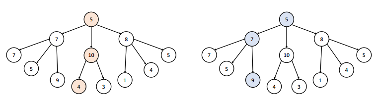

# 그리디 알고리즘

# 의미

---

- 현재 상황에서 가장 좋은 것(최선의 선택)을 고르는 알고리즘
- 주의할 점: 현재 최선의 선택(로컬 최적해)이 항상 최종적인 결과 도출에 대한 최적해(글로벌 최적해)를 보장해주는 것은 아님

# 개요

---

- 알고리즘의 암기가 필요 없음
- 유형파악 및 훈련이 중요
- 대체로 정렬 알고리즘과 함께 출제

# 그리디 알고리즘 조건

---

1. 탐욕스러운 선택 조건: 그리디 알고리즘을 사용하면 최적해가 나올 수 있는 문제여야 함
2. 최적 부분 구조 조건: 문제에 대한 최종 해결 방법이 부분 문제에 대해서도 또한 최적의 해결 방법이다라는 조건

# 문제 해결 방법

---

1. 선택 절차(Selection Procedure): 현재 상태에서의 최적의 해답을 선택
2. 적절성 검사(Feasibility Check): 선택된 해가 문제의 조건을 만족하는지 검사
3. 해답 검사(Solution Check): 원래의 문제가 해결되었는지 검사하고, 해결되지 않았다면 선택 절차로 돌아가 위의 과정을 반복

---

# 참고한 글 출처

---

[탐욕법(그리디) 알고리즘](https://velog.io/@contea95/%ED%83%90%EC%9A%95%EB%B2%95%EA%B7%B8%EB%A6%AC%EB%94%94-%EC%95%8C%EA%B3%A0%EB%A6%AC%EC%A6%98)
