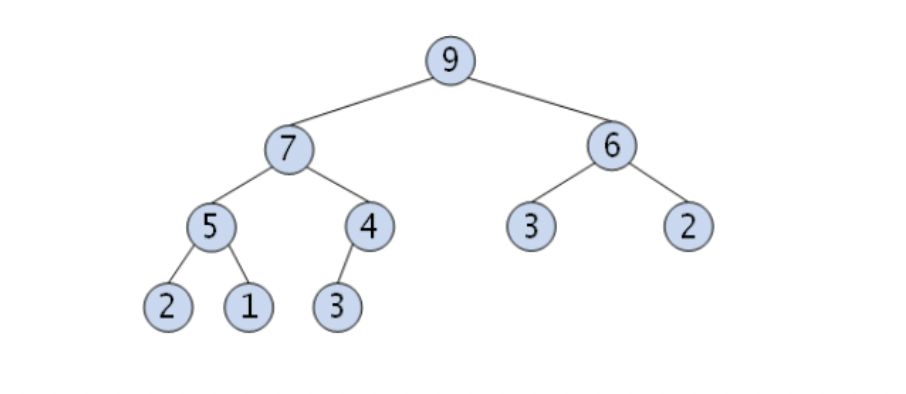
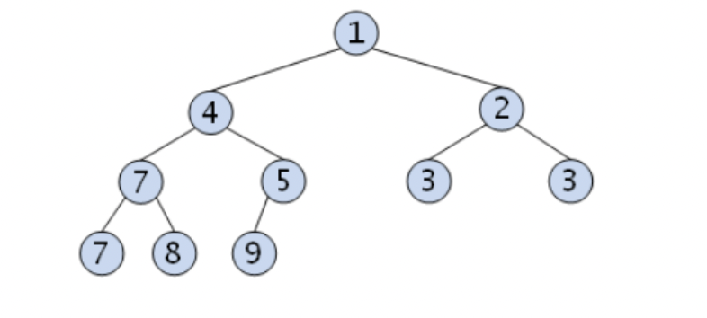
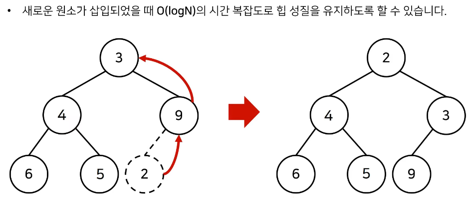
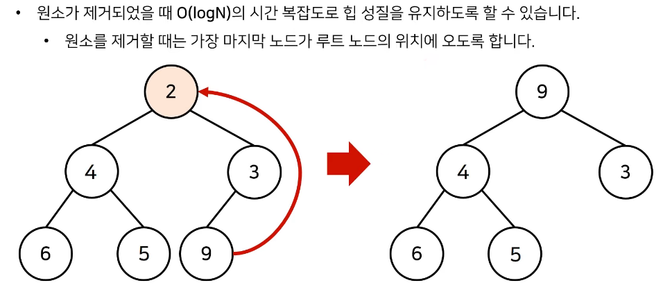
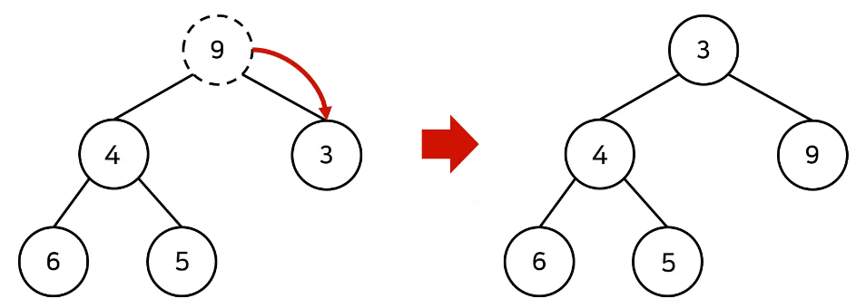

# 우선순위 큐

# 의미

---

- 우선순위 큐는 **우선순위가 가장 높은 데이터를 가장 먼저 삭제**하는 자료구조
- 선입선출(FIFO)인 일반적인 큐와 다름에 주의

# 특징

---

1. 높은 우선순위의 요소를 먼저 꺼내서 처리하는 구조
2. 우선순위 큐에 들어가는 원소는 **비교가 가능한 기준**이 있어야 함
3. 내부 요소는 힙으로 구성되어 있기 때문에 **이진 트리 구조**이며, 시간 복잡도는 O(NLogN)
4. 우선순위를 중요시해야 하는 상황에서 주로 쓰임

# 우선순위 큐 구현 방법

---

- **리스트**를 기반으로 구현
    - 데이터 삽입 및 삭제 과정에서 데이터를 한 칸씩 당기거나 밀어야 하는 연산을 계속해야 함
    - 데이터 삽입 위치를 찾기 위해 배열에 저장된 모든 데이터와 우선순위를 비교해야 함

- **연결 리스트**를 기반으로 구현
    - 데이터 삽입 위치를 찾기 위해 첫 번째 노드부터 마지막 노드까지 저장된 데이터와 우선순위 비교를 진행할 가능성이 있음

- **힙**을 이용하여 구현
    - 위와 같은 이유로 힙을 이용하는 것이 일반적인 방법
    

# 힙(Heap)

---

- 완전 이진 트리 자료구조의 일종

- 최대 힙
    - 루트 노드가 가장 큰 값을 가짐
    - 값이 가장 **큰** 데이터가 우선적으로 제거됨

- 최소 힙
    - 루트 노드가 가장 작은 값을 가지므로 루트 노드가 우선적으로 제거됨
    - 값이 가장 **작은** 데이터가 우선적으로 제거됨
    

# 최소 힙의 원소 삽입/삭제

---

- 원소 삽입의 경우 (2가 들어왔을 경우 예제)
    - 삽입할 원소를 마지막 노드에 위치시킴
    - 최소 힙의 규칙에 맞게 트리를 재정렬함

- 원소 삭제의 경우 (2를 삭제할 때 예제)
    - 루트 노드를 제거 후, 마지막 노드가 루트 노드에 위치하도록 함
    - 최소 힙의 규칙에 맞게 트리를 재정렬함

# 참고한 글 출처

---

[[알고리즘] 우선순위 큐(Priority Queue)와 힙(Heap)](https://velog.io/@jun_/Algorithm-%EC%9A%B0%EC%84%A0%EC%88%9C%EC%9C%84-%ED%81%90Priority-Queue%EC%99%80-%ED%9E%99Heap)

[자료구조: 우선순위 큐(Priority Queue)와 힙(Heap) 10분 핵심 요약](https://youtu.be/AjFlp951nz0)
