# 트리

---

## 트리란

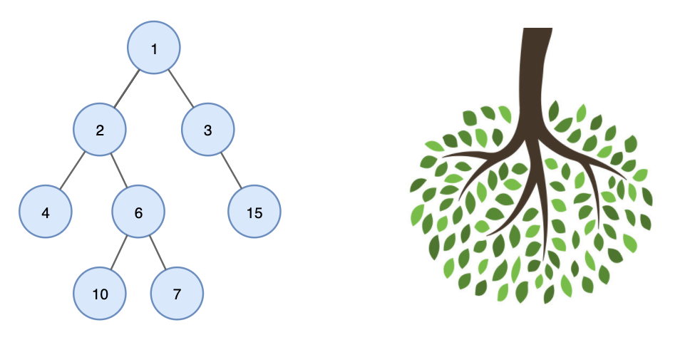

- 노드들이 나무 가지처럼 연결된 비선형 계층적 자료구조

## 구성

- 노드
- 간선

## 용어

### 노드

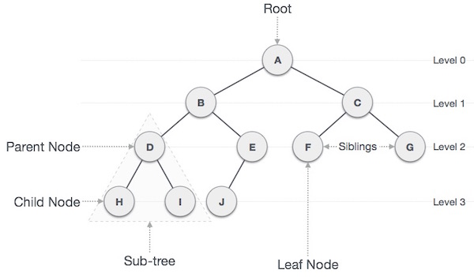

- 루트 노드: 부모가 없는 최상위 노드
- 부모 노드: 자식 노드를 가진 노드
- 자식 노드: 부모 노드의 하위 노드
- 형제 노드: 같은 부모를 가지는 노드
- 단말 노드: 자식 노드가 없는 노드
    
    

### 간선

- 노드와 노드 간의 연결선

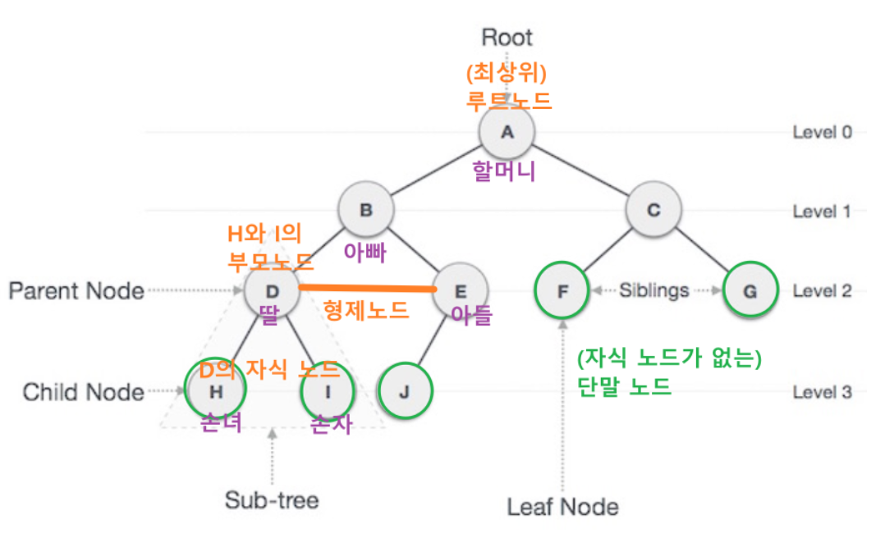

### 깊이와 높이

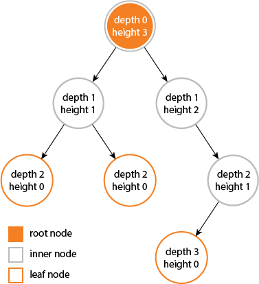

- 깊이: 루트에서부터 특정 노드까지의 간선 수
- 높이: 특정 노드에서 단말 노드까지 가장 긴 경로의 간선 수

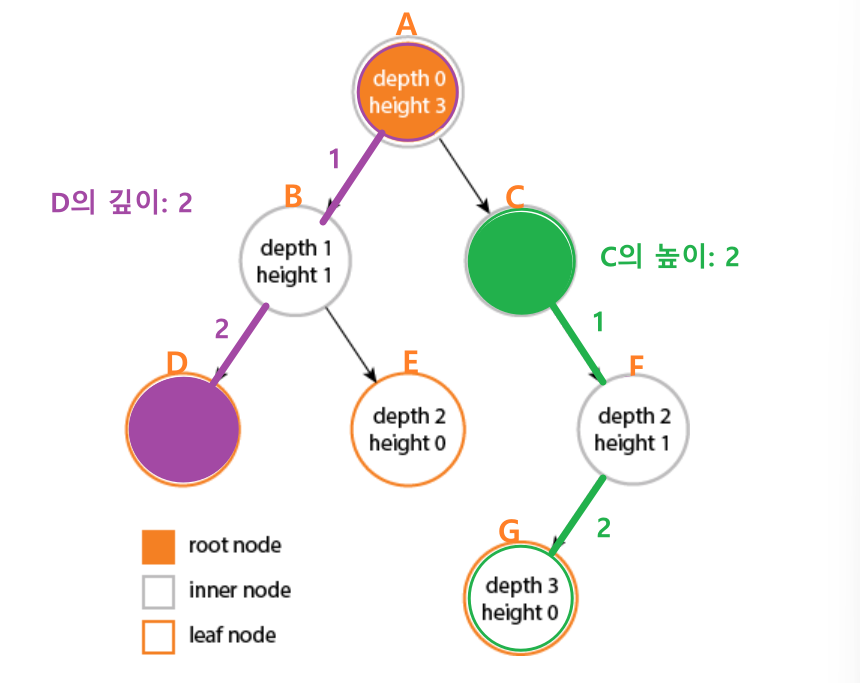

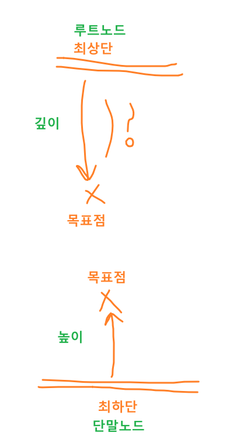

### 레벨

- 루트에서 특정 노드까지의 간선 수

### 차수

- 노드의 자식 수

## 특징

- 하나의 자료 뒤에 여러 개의 자료가 존재(1:n 관계 /  n:m 관계)하는 **비선형 자료구조**
- 트리 내에 또 다른 트리가 있는 **재귀적 자료 구조**
- 사이클을 갖지 않는 **비순환 그래프 구조**
    - 다음은 사이클을 갖기 때문에 트리가 아님
    
    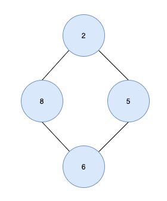
    
- 노드와 부모 자식 관계를 맺고 있는 **계층형 자료 구조**
- 모든 자식 노드는 하나의 부모 노드만 갖음
- 노드가 n개인 트리는 항상 n-1 개의 간선을 가짐

## 트리 종류

### 편향 트리

- 모든 노드들이 하나의 자식만 가진 트리

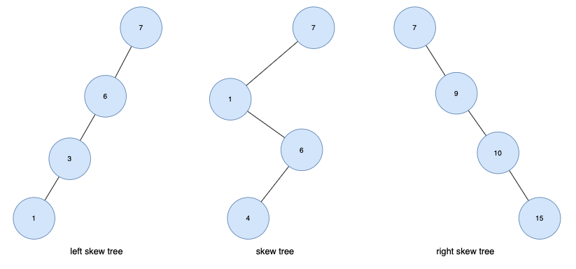

### 이진 트리

- 각 노드가 최대 2개의 차수(자식 노드)를 가지는 트리

### 완전 이진 트리

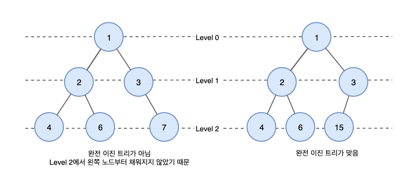

- 마지막 레벨을 제외하고 모든 레벨이 완전히 채워져 있는 트리
- 노드가 위에서 아래로, 왼쪽에서 오른쪽으로 채워짐

### 이진 탐색 트리

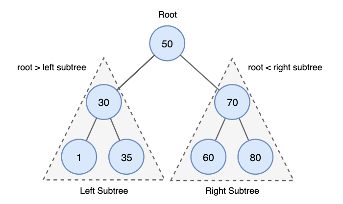

- 순서화된 이진 트리
- 노드의 왼쪽 자식은 부모의 값보다 작은 값을 가져야 하며 노드의 오른쪽 자식은 부모의 값보다 큰 값을 가져야 함

## 활용

- 계층적 데이터 저장
    - 파일 및 폴더
    
    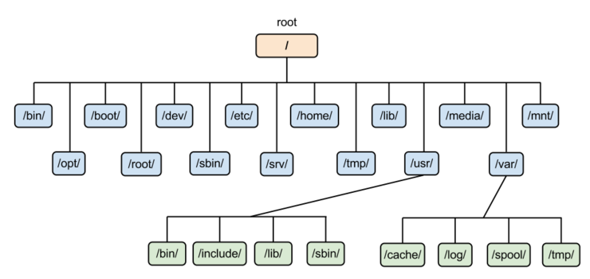
    
- 효율적인 검색 속도
    - 효율적인 삽입, 삭제, 검색에 활용
- 힙
    - 완전 이진 트리를 기본으로 한 자료구조
- DB 인덱싱

> **Reference**
> 
> 
> [[자료구조] 트리 (Tree)](https://yoongrammer.tistory.com/68)
> 
> [강의노트 22. 자료구조 - tree(트리), heap(힙)](https://wayhome25.github.io/cs/2017/04/19/cs-23/)
> 
> [[자료구조] 이진 트리 (Binary tree) 알아보기](https://yoongrammer.tistory.com/69?category=956616)
>
